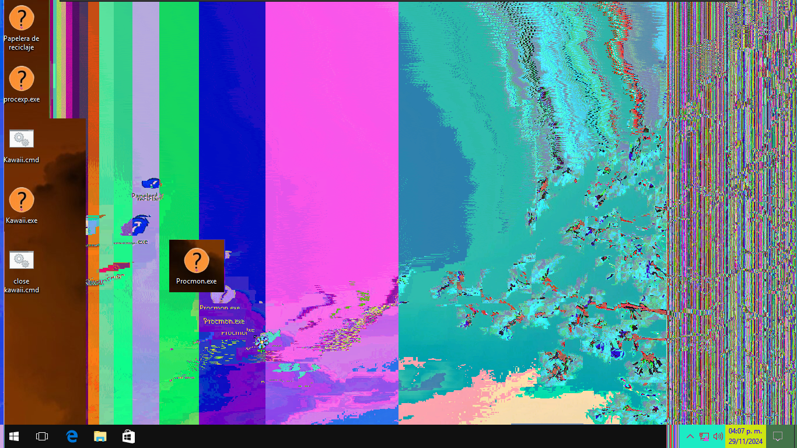
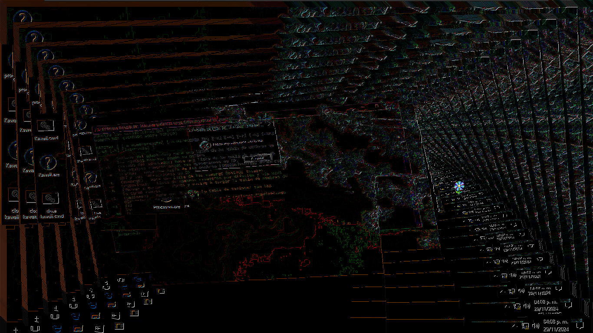
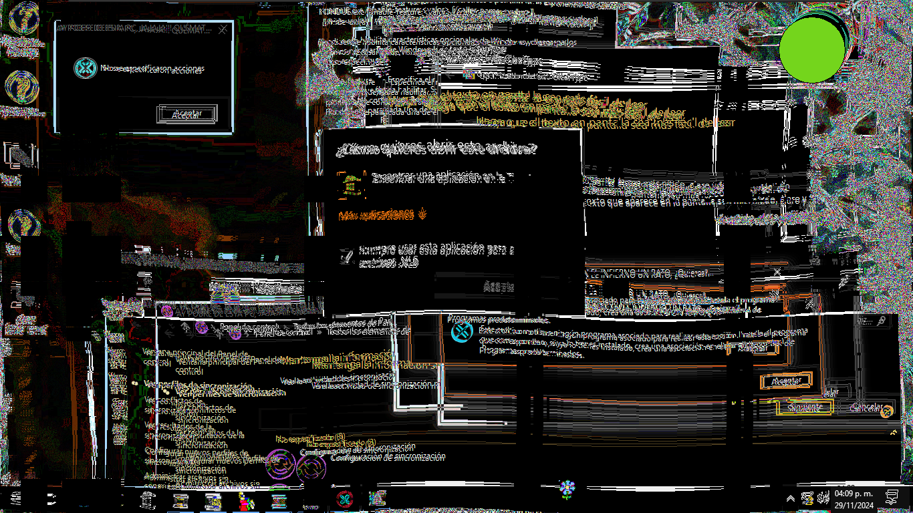

## Spanish | [English](https://github.com/ItzMoon931/Kawaii/README.md)
# Información sobre Kawaii 
Kawaii es un malware muy peligroso. Puede destruir información personal, eliminar archivos necesarios para iniciar Windows, destruir el registro, modificar el MBR, eliminar archivos aleatorios de todo el ~disco C completo (SOLO EL DISCO C, NINGÚN OTRO). Tengo que comprobar si esto es cierto xd~ **Lo confirmé, en caso de que tengas más de una máquina en la máquina de prueba, puede dañar todas las máquinas.**

###### Estoy creando una versión de Kawaii para quienes deseen destruir máquina por máquina (si tienen varias máquinas) y no hacer el combo de: “2x1”.

  

 Más Información 📄 

  * Creado por: Joseantonio3100 alias ItzMoon931  
  * Tipo de archivo: exe  
  * Sistemas soportados: Windows 7 y superior  
  * Programado en: C# (Csharp)  
  * Requisitos: .Net Framework 4.0  
  * Nivel de destrucción: 11 (Porque un 10 no es suficiente para describir lo peligroso que es).  
  * Idiomas: Español e Inglés (*Kawaii detecta el idioma de tu dispositivo y se ajusta al idioma detectado. Si tu computadora no tiene configurado el idioma español, se establecerá en inglés, independientemente de si es coreano, japonés o cualquier otro idioma.*)

# ¡ADVERTENCIA! ⚠

Este malware fue creado con fines educativos y de entretenimiento. No fue hecho para realizar actos ilegales. Este malware puede destruir mucho el sistema, Windows, así que úsalo en un entorno virtual.

Úsalo en una máquina virtual. Puedes usar [VirtualBox](https://www.virtualbox.org/wiki/Downloads) o [VMware](https://www.vmware.com/products/desktop-hypervisor/workstation-and-fusion), dos aplicaciones muy famosas para ejecutar máquinas virtuales sin afectar el sistema principal. :D

**El creador (yo xd) NO SE RESPONSABILIZA POR LOS DAÑOS QUE ESTE MALWARE PUEDA CAUSAR.**

# AVISO 📣
Si sufres de epilepsia o fotosensibilidad, NO EJECUTES ESTE MALWARE. 👀

Úsalo sabiamente... y que Dios esté contigo. 🙏

# Capturas 📷

  

 Haz clic para ver las capturas 📄 

    
   

# Payloads 🔧
Este malware tiene 3 fases:

* Fase 1 (Instalación):  
  Esta fase consiste en la instalación, donde se extraen recursos, se modifica el registro (regedit) y se crean muchas... pero muchas copias de sí mismo.  
* Fase 2 (Pequeños GDIs):  
  Personaliza el sistema después del reinicio, haciéndolo más “kawaii”, muestra un sonido “especial” y un pequeño GDI mientras prepara la fase 3...  
* Fase 3 (Final):  
  Es la fase final, mostrando un total de 15 GDIs, con música Bytebeat correspondiente, mientras destruye tu Windows en segundo plano.  

# Contraseñas 🔑

La contraseña del malware en el zip es: **"kawaii"**.

La contraseña para el inicio de la fase 3 y el final de la fase 2 es: **"cute"** [a lo que me refería](https://github.com/ItzMoon931/Kawaii/Assets/Fase3Password.png).

# Preguntas Frecuentes (FAQ)

---

### 1. ¿Qué pasa si ejecuto esto en una PC real?  
Puede ejecutarse, pero recibirás **4 advertencias** antes de activarse. Si ignoras todas las advertencias, despídete de tu computadora.  

---

### 2. Estoy intentando extraer el malware del ZIP, pero está protegido con contraseña. ¿Cuál es?  
La contraseña para el archivo ZIP que contiene el malware es: **`kawaii`**. De hecho, [si haces clic](#contraseñas-) aquí está la contraseña. :D  

---

### 3. Tengo problemas para ejecutarlo, ¿qué hago?  
Abre un "issue" en el [repositorio de Kawaii](https://github.com/ItzMoon931/Kawaii) y describe tu problema en detalle.  
Si es posible, adjunta imágenes o videos como prueba para ayudar con la resolución.  

---

### 4. ¿Cómo puedo evitar que pase algo malo con este malware?  
Simplemente **no lo ejecutes**. Sé inteligente.  

---

### 5. ¿Puede este malware propagarse a otras computadoras a través de una red o algo similar?  
No, este malware no está diseñado para:  
- Propagarse a otras computadoras o a través de la red.  
- Afectar tu máquina principal (siempre que lo ejecutes en una máquina virtual).  
- Robar información, manipular el portapapeles o realizar acciones maliciosas.  

Su propósito es puramente **recreativo y educativo**.  

---

### 6. ¿Hay algo más que deba saber antes de ejecutar este malware?  
Sí, si cambias la fecha en Windows a **11 de octubre** (de cualquier año), se activará un payload especial.  

# Video de Prueba 📸

#### No hay video de Kawaii
